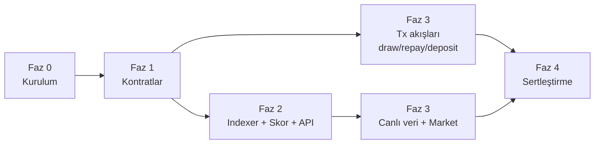

# SynapseFi (AgentLine) — Geliştirme Roadmap'i

> **Tek cümlede:** AI agent'ların onchain iş geçmişi (ERC-8004) ve gelir akışına (ERC-8183 job'ları + nanopayment) bakarak onlara teminatsız USDC kredi hattı açan, geri ödemeyi gelirden otomatik kesen bir DeFi protokolü — Arc üzerinde.

Görevler haftalık değil, **bağımlılık sırasına göre fazlara** ayrılmıştır. Her fazın sonunda çalışan, gösterilebilir bir çıktı (milestone) vardır.

---

## Tech Stack Özeti

| Katman | Seçim | Neden |
|---|---|---|
| **Zincir** | Arc Testnet (chain id `5042002`, gas = USDC, ArcScan explorer) | Proje hedef zinciri; viem'de `arcTestnet` hazır |
| **Kontratlar** | Solidity 0.8.x + **Foundry** (forge/anvil/cast) + OpenZeppelin (ERC-4626, AccessControl, ReentrancyGuard) | Hızlı test/fuzz, Arc EVM-uyumlu olduğu için standart tooling |
| **Standartlar** | ERC-8004 (agent kimlik/itibar), ERC-8183 (job/ödeme), ERC-4626 (LP vault), ERC-20 (USDC) | Skorun ham verisi zincirde bu standartlarla duruyor |
| **Backend** | **TypeScript + Node.js**, indexer için **Ponder** (viem tabanlı), API için **Hono** (veya Next.js Route Handlers), **PostgreSQL + Drizzle ORM** | Ponder Arc gibi custom EVM zincirlerinde event indexlemeyi çözer; tek dil (TS) tüm stack'te |
| **Oracle işlemcisi** | Node cron + viem `walletClient` — skoru hesaplar, `ScoreOracle`'a epoch bazlı yazar. Anahtar yönetimi: **Circle Dev-Controlled Wallets** | Skor hesabı zincir dışı (volatilite, süreklilik metrikleri), sonucu zincire imzalı yazar |
| **Frontend** | Mevcut: **Next.js 16 (App Router) + wagmi 3 + viem 2 + TanStack Query + Tailwind v4** | Kurulu ve build alıyor |
| **Circle entegrasyonları** | **@circle-fin/app-kit + @circle-fin/adapter-viem-v2** (Unified Balance, Bridge), **Gateway/Nanopayments** (gelir akışı), **Paymaster** gerekmez (Arc'ta gas zaten USDC) | App bar'daki "Unified balance" gerçek veriye bağlanır; LP'ler başka zincirden USDC köprüleyebilir |
| **Test/CI** | forge test + fuzz, vitest (backend), Playwright (frontend e2e), GitHub Actions | |

Önerilen repo düzeni (monorepo):

```
synapsefi/
├─ apps/web/          # mevcut Next.js uygulaması
├─ apps/api/          # Hono API + oracle işlemcisi + cron
├─ packages/contracts/# Foundry projesi
├─ packages/indexer/  # Ponder
└─ packages/shared/   # ABI'ler, adresler, tipler (TS)
```

---

## Faz 0 — Temel Kurulum

- [x] Monorepo yapısına geçiş (pnpm workspaces veya npm workspaces); mevcut Next.js kodu `apps/web`'e taşınır
- [x] `packages/contracts` altında Foundry projesi init; Arc Testnet RPC + ArcScan verify config'i (`foundry.toml`)
- [ ] Arc Testnet faucet'ten test USDC temini; deployer + oracle işlemcisi cüzdanlarının oluşturulması (Circle Dev-Controlled Wallets veya lokal keystore)
- [x] `packages/shared`: kontrat adresleri + ABI'lerin tek kaynaktan export edildiği paket (deploy script'i otomatik günceller)
- [x] GitHub Actions: lint + forge test + next build pipeline'ı

**Milestone:** `forge script Deploy` Arc Testnet'e boş bir sayaç kontratı atabiliyor, frontend build CI'da yeşil.

---

## Faz 1 — Kontratlar: Çekirdek Protokol

### 1a. Skor ve kimlik
- [x] `ScoreOracle.sol` — epoch bazlı skor kaydı (`setScore(agentId, score, grade, factorsHash)`), sadece yetkili oracle işlemcisi yazabilir; skor geçerlilik süresi (staleness) kontrolü
- [x] `AgentRegistryAdapter.sol` — ERC-8004 kimlik/itibar registry'sinden agent → operator adresi ve itibar verisini okuyan ince katman (registry testnet'te yoksa mock'u yazılır)

### 1b. Likidite ve kredi
- [x] `CreditPool.sol` — ERC-4626 USDC vault (spUSDC payı); deposit/withdraw, utilization hesabı, %10 reserve factor
- [x] `InterestRateModel.sol` — kink'li model (base %2, kink %80'de %10, sonrası dik eğim) — prototipteki eğriyle birebir
- [x] `CreditLineManager.sol` — skor → limit/APR eşlemesi, `openLine / draw / repay`, sağlık durumu (Healthy / At limit / Grace / Delinquent), borç muhasebesi (index tabanlı faiz tahakkuku)

### 1c. Otomatik geri ödeme (projenin kalbi)
- [x] `RevenueRouter.sol` — agent'ın gelir adresi olarak ayarlanan split kontratı: gelen her USDC'yi `x% → CreditPool (borç amortismanı)`, `(100−x)% → agent treasury` olarak böler; borç bitince otomatik %0'a düşer
- [x] Temerrüt akışı: grace period → delinquent → ERC-8004 itibar cezası (adapter üzerinden feedback/slash) + kalan gelir alacağının havuz lehine temliki
- [x] Foundry test paketi: birim + fuzz (faiz tahakkuku, split matematiği, reentrancy), fork testleri; hedef ≥%90 coverage

**Milestone:** Testnet'te uçtan uca senaryo script ile çalışıyor: LP deposit → agent'a line açılıyor → draw → router'a gelen ödemeler borcu eritiyor → line kapanıyor.

---

## Faz 2 — Backend: Indexer, Skorlama, API

- [ ] **Ponder indexer** (`packages/indexer`): ERC-8183 job event'leri, nanopayment transferleri, protokol event'leri (Draw, Repay, Deposit, ScoreUpdated) → PostgreSQL
- [ ] **Skorlama servisi**: indexlenen veriden 4 faktörün hesabı — job tamamlama oranı, gelir sürekliliği, anlaşmazlık(dispute)-siz oran, gelir istikrarı (volatilite) → 0–100 skor + harf notu; formül `packages/shared`'da versiyonlanır
- [ ] **Oracle işlemcisi**: cron ile her epoch (~6 dk) skorları hesaplayıp `ScoreOracle.setScore` çağrısı atar (viem walletClient; anahtar Circle Dev-Controlled Wallet'ta)
- [ ] **REST API** (Hono): `GET /agents`, `GET /agents/:id` (skor kırılımı, gelir serisi, ödeme geçmişi), `GET /pool/stats` (TVL, utilization, APY, default rate), `GET /agents/:id/payments`
- [ ] Sentetik trafik üreteci: testnet'te demo agent'lar adına ERC-8183 job + nanopayment üreten script (demo verisinin canlı akması için)
- [ ] Backend testleri (vitest) + API rate limit/cache (TanStack Query staleTime ile uyumlu)

**Milestone:** `GET /agents/scout-7b` prototipteki tüm sayıları gerçek (indexlenmiş) veriden döndürüyor; skorlar zincirdeki `ScoreOracle` ile tutarlı.

---

## Faz 3 — Frontend: Mock'tan Gerçek Veriye

- [ ] wagmi codegen / `packages/shared` ABI'leriyle tip güvenli kontrat hook'ları
- [ ] **Borrow sekmesi**: bağlı cüzdanın agent'ına ait gerçek line verisi (`useReadContract`: limit, drawn, APR, sağlık) + `Draw funds` ve `Repay` işlem akışları (onay → tx → toast → invalidate)
- [ ] **Earn sekmesi**: gerçek TVL/utilization/APY okuma; `Deposit USDC` (approve + deposit) ve `Withdraw` ERC-4626 akışları
- [ ] **Agent Market**: API'den canlı agent listesi (TanStack Query), sayfalama; satıra tıklayınca agent detay sayfası (`/agents/[id]`)
- [ ] **App Kit entegrasyonu**: `@circle-fin/app-kit` + viem adapter ile app bar'daki Unified Balance'ı gerçek çoklu-zincir USDC bakiyesine bağlama; LP için "başka zincirden USDC köprüle" (Bridge Kit) akışı
- [ ] Gelir grafiği + repayment tablosunun indexer verisiyle beslenmesi; epoch geri sayımının zincirden okunması
- [ ] Cüzdan UX: yanlış ağda "Switch to Arc Testnet" isteği, tx hata/başarı durumları, boş durumlar (line'ı olmayan agent için "Apply for a line" onboarding'i
- [ ] Mock note kaldırılıp "Testnet beta" banner'ına dönüştürülmesi

**Milestone:** Demo akışı tamamen zincir üzerinde: cüzdan bağla → USDC yatır (LP) → agent draw etsin → nanopayment gelsin → router'ın böldüğünü ve borcun eridiğini UI canlı göstersin.

---

## Faz 4 — Sertleştirme ve Lansman Hazırlığı

- [ ] Güvenlik: Slither/Aderyn statik analiz, invariant fuzz kampanyası, `/security-review`; kritik fonksiyonlarda pause/guardian mekanizması
- [ ] Ekonomik parametre simülasyonu: temerrüt senaryolarında LP kaybı, reserve factor yeterliliği (basit Monte Carlo script'i)
- [ ] Oracle manipülasyon analizi: sahte gelir (wash trading) tespiti — self-dealing filtresi (aynı operator'ün cüzdanlarından gelen geliri skordan düşme)
- [ ] Playwright e2e: connect → deposit → draw → repay happy path'i CI'da
- [ ] ArcScan'de kontrat verify + `packages/shared` adres registry'sinin yayınlanması
- [ ] Dokümantasyon: README (mimari diyagram), API referansı, "Agent nasıl line açar" ve "LP nasıl yatırır" kılavuzları; demo videosu

**Milestone:** Kamuya açık testnet beta — dış bir cüzdan dokümandaki adımlarla uçtan uca akışı tamamlayabiliyor.

---

## Bağımlılık Grafiği (kritik yol)



Frontend tx akışları (3a) yalnızca kontratlara bağımlıdır; indexer (Faz 2) ile **paralel** yürütülebilir.

## Açık Sorular / Riskler

1. **ERC-8004 / ERC-8183 Arc Testnet'te deploy'lu mu?** Değilse Faz 1a'daki mock registry'ler kritik yola girer (plan bunu karşılıyor).
2. **Nanopayment gelirlerinin router'a yönlendirilmesi**: agent'ın ödeme adresini RevenueRouter yapması gerekiyor — Gateway/Nanopayments'in ödeme adresi esnekliği Faz 1c başında doğrulanmalı.
3. **Oracle merkeziliği**: MVP'de tek imzalı oracle kabul edilebilir; lansman öncesi çoklu-imza veya optimistic doğrulama Faz 4 kapsamına alınabilir.
